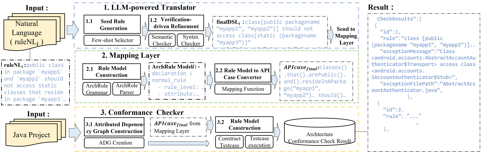

This repository illustrates the tool, data, and scripts of our ASE 2025 under-reviewing work ——DSL-based Software Architecture Compliance Checking with Natural Language as Blueprints.

 We opened all of the collected data of the investigated real-world subjects. Due to the file size limit of GitHub, we upload the processed data to this repository. 

We have provided a video [AutoArc-sample-demo](Data/Setup/AutoArc-sample-demo.mov)  to demonstrate of our tool `DroidDS` running on a sample project.

This is the overview of AutoArc:

## Directory Structure

The whole directory tree goes like the following: 

```
├─Data
│  ├─Results
│  │  ├─RQ1&RQ2
│  │  │  ├─Prompt.md
│  │  │  ├─RuleSet
│  │  │  ├─Micro-BenchMarkA 
│  │  │  ├─NL_input
│  │  │  ├─AutoArcResult
│  │  │  └─RQ1.csv 
│  │  ├─RQ2
│  │  │  └─RQ2.csv
│  │  ├─RQ3
│  │  │  ├─RuleSet
│  │  │  ├─Micro-BenchMarkB
│  │  │  ├─NL1_input.csv
│  │  │  ├─AutoArcResult
│  │  │  └─RQ3.csv
│  │  └─RQ4
│  │     ├─initialRuleset
│  │     │  └─Ruleset_initial.csv
│  │     ├─Macro-BenchmarkC
│  │     │  ├─benchmark-C
│  │     │  └─benchmark-NC
│  │     ├─NL1_input
│  │     ├─AutoArc-Result
│  │     ├─Archunit-Result
│  │     ├─JArchitect-Result 
│  │     └─RQ4.csv
│  └─Setup
│     └─ProjectScale.csv
└─Method
   └─AutoArc
      ├─bin
      │  └─AutoArc.sh
      └─lib
         ├─ConformanceChecker.jar
         └─TranslaterMappingLayer

```


## Method

### Requirements 

-  Operating System : *Linux*
- `Python` 3.0 or higher.
- `Java Runtime Environment (JRE)` or `Java Development Kit (JDK)` version 21 or higher.
- **Ollama** installed,  (Download and install Ollama from https://ollama.com), with the following models preloaded:
  - LLaMA3.3 70B
  - Qwen2.5 72B
  - Deepseek R1 70B

To switch models or adjust the server endpoints, update the settings in [Method/AutoArc/lib/TranslaterMappingLayer\config.toml](Method/AutoArc/lib/TranslaterMappingLayer\config.toml).

### Usage

To use `AutoArc`, run the script from the command line(After cloning the code repository, please unzip the  [enre.zip](Method/AutoArc/lib/enre.zip) file in its directory), specifying the necessary arguments. Here is a breakdown of the available arguments:

```less
usage: AutoArc.bat [-d DIRETORY] [-r ARCHTECTURE_VIOLATION_RULE] [-p PROJECT_NAME] [-t PROJECT_TYPe] 

arguments:
`-dir` , `-d`: Required Root directory for the project to check violations.
`-rule`, `-r`: Archtecture violation rule for the check.
`-projectname`, `-p`: The name of the violation check task project.
`-type `, `-t`: The type of the project to check violations,java or javaClass.

eaxmple usage:
Linux:
.\bin\AutoArc.sh \\
  -d "/data1/Lnike123/Work/playground/Experiment/RQ4/dataset/opensource/apache-ant-1.8.4/"\\
  -r "public class should be enums" \\
  -p "myViolationCheck1" \\
  -t "java"
```

### return value

| Exit Status | Corresponding explanations                                   |
| ----------- | ------------------------------------------------------------ |
| 0           | Everything is fine, no violations found                      |
| 1           | Couldn't understand command-line parameters or AutoArc exited with an exception |
| 4           | At least one violation has been detected                     |

## Data

### Method prompt in LLM-powered translator

[Method/AutoArc/lib/TranslaterMappingLayer/interact_with_llm/src/support](Method/AutoArc/lib/TranslaterMappingLayer/interact_with_llm/src/support) This folder contains the prompts for LLM-powerd translator.

### Setup

This folder contains the initial data for the project needed to run the four RQs of the experiment.

- Due to the size limitation of the GitHub repository, we uploaded the 9 real-world project sets used in RQ4 to https://zenodo.org/records/15607672
- RQ1&RQ2: [Data/Results/RQ1/prompt.md](Data/Results/RQ1/prompt.md) is the prompt to generate the initial `NL_input`.
- RQ4: `ProjectScale.csv`: Contains files , blanks and code information for real word project.

### Results

### RQ1: How accurate is the LLM-powered Translator  in generating ArchRule DSL from natural language descriptions of architectural rules? 

All files or directories mentioned below are in [Data/Results/RQ1](Data/Results/RQ1).  

- The  `Ruleset` folder contains the 210 architecture rules for RQ1, `NL_input` contains three form natural language (NL_1, NL_2, NL_3).
- The `AutoArcResult` folder contains the results of running RQ1 cases with AutoArc.
- `RQ1.csv` contains the results of RQ1, including success, shifted,failed counts for 3 LLMs and 3 NLs, and the percentage of them.

### RQ2: How effective is the Verification-driven Refinement in improving rule correctness?

The file is in [Data/Results/RQ1&RQ2](Data/Results/RQ2).

- `RQ2.csv`  contains the results of RQ2, including P(first), P(final), P(develop) for for 3 LLMs and 3 NLs.

### RQ3: How does the end-to-end accuracy of AutoArC compare to existing methods on micro-benchmarks?

All files or directories mentioned below are in [Data/Results/RQ3](Data/Results/RQ3).

- `Benchmark`  contains the Micro-BenchMark for RQ3, including code snips and the code comments.
- `RuleSet` contains the rules for check the Micro-BenchMark.
- `AutoArcResult` contains the output of  cheching Micro-BenchMark.
- `RQ3.csv`  contains the Recall, Precision, and F1 Score calculated against Micro-BenchMark for AutoArc.

### RQ4: How does the end-to-end accuracy of AutoArC compare to existing methods on macro-benchmarks

All files or directories mentioned below are in [Data/Results/RQ4](Data/Results/RQ4). 

- we implement the check in 9 real-word projects with 15 rules.

  - `input` contains the NL input.

  - The folder  `benchmark`  contains the BenchMarks manually curated by us.

  - `AutoArc-Result` contains AutoArc results.

  - `JArchtect` contains JArchtectresults.

  - `Archunit` contains Archunitresults.

- The file `RQ4.csv` ,contains  the Recall, Precision, and F1 Score calculated against the BenchMark for both AutoArc, JArchtect and Archunit, including evaluations on 9 real-word projects.


